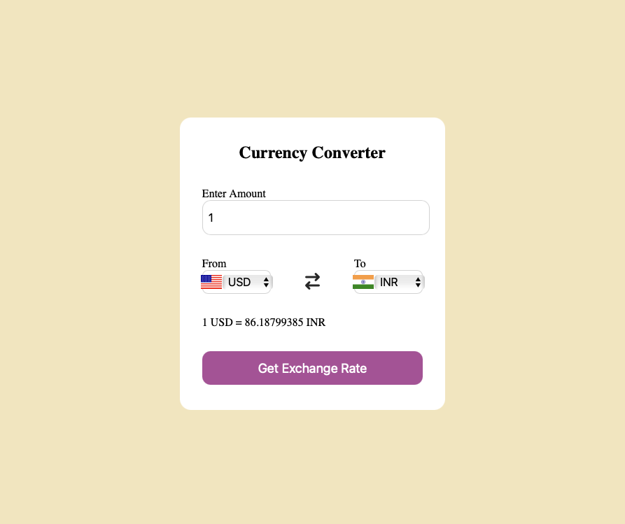

# Currency Converter

A simple and user-friendly web application for converting currencies. This tool allows users to input an amount, select the currencies they want to convert between, and view the exchange rate.



---

## Table of Contents
- [Features](#features)
- [Technologies Used](#technologies-used)
- [How to Run](#how-to-run)
- [Project Structure](#project-structure)
- [License](#license)

---

## Features
- **Real-Time Conversion**: Displays the exchange rate between selected currencies.
- **Interactive UI**: Allows users to swap currencies with a single button click.
- **Responsive Design**: Works seamlessly across devices.

---

## Technologies Used
- **HTML**: For structuring the web content.
- **CSS**: For styling the application and providing a polished look.
- **JavaScript**: For the logic and functionality of the currency conversion.

---

## How to Run
1. Clone this repository:
   ```bash
   git clone https://github.com/dinesh776/CurrencyConverter.git
   ```
2. Navigate to the project directory:
   ```bash
   cd CurrencyConverter
   ```
3. Open `index.html` in your browser to view the application.

---

## Project Structure
```
CurrencyConverter/
|
├── index.html         # Main HTML file
├── style.css          # CSS file for styling
├── app.js             # JavaScript logic
├── codes.js           # Auxiliary JavaScript file
└── screenshot.png     # Screenshot of the application
```

---

## License
This project is licensed under the MIT License. See the [LICENSE](./LICENSE) file for details.

---


